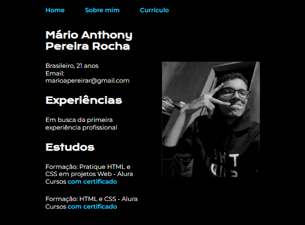

# Portfolio

O projeto é um portfolio de desenvolvedor front-end.

| :placard: Vitrine.Dev |     |
| -------------  | --- |
| :sparkles: Nome        | **Portfolio Mario Anthony**
| :label: Tecnologias | html, css 
| :rocket: URL         | https://url-deploy.com.br
| :fire: Desafio     | https://cursos.alura.com.br/formacao-html-css-v534235

<!-- Inserir imagem com a #vitrinedev ao final do link -->

## Detalhes do projeto

 Esse projeto foi o primeiro desafio da Formação de Front-end da Alura. 
 A ideia era criar um portfolio simples, mas funcional para mostrar as habilidades
 de programação e usar até mesmo como site proprio. 

 Dentro das aulas foram feitas as paginas de Home e Sobre mim, feitas desde a estruturação
 até a estilização delas, e por final foi feito do desafio ao aluno de fazer uma terceira 
 página com o seu currículo, pondo em prática os ensinamentos das aulas anteriores.

  
 
 Após isso foi trabalhado a responsividade e o deploy do site, e assim finalizando
 todo o projeto.
 
